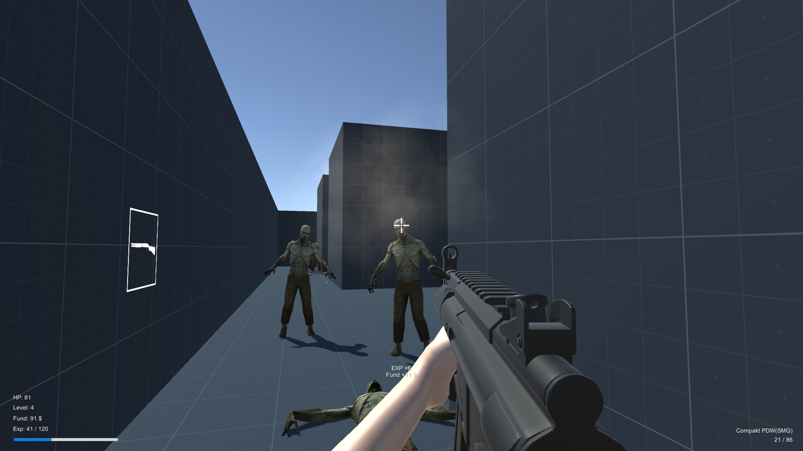

### Simple Zombie FPS Game

This is a basic first-person shooter (FPS) game built using C# where players have to survive waves of incoming zombies by eliminating them. The game features simple graphics and mechanics, focusing on the core experience of zombie shooting.

#### Features:
- First-person perspective.
- Waves of zombies spawn at intervals.
- Player can shoot zombies to eliminate them.
- Health bar to indicate player's health status.
- Score tracking system.

#### Screenshots:




#### Gameplay:
1. Use WASD keys to move the player character.
2. Aim using the mouse cursor.
3. Click the left mouse button to shoot and eliminate zombies.
4. Survive as long as possible by defeating waves of zombies.
5. Health decreases when zombies attack; the game ends when the player's health reaches zero.

#### Technologies Used:
- C#
- Unity Game Engine

#### Installation:
Clone the repository:
```bash
git clone https://github.com/Devil-Code/zombie-fps-game.git
```
Open the project in Unity and build it for your desired platform (Windows, macOS, Linux, etc.).

#### Code Overview:
- The main game logic is implemented in C# scripts within the Unity project.
- Scripts handle player movement, zombie behavior, shooting mechanics, wave spawning, health management, and scoring.

#### License:
This project is licensed under the [GNU General Public License v3.0](LICENSE).

#### Author:
- Your Name ([Your GitHub Profile](https://github.com/yourusername))

Feel free to contribute by submitting bug reports, feature requests, or pull requests!
